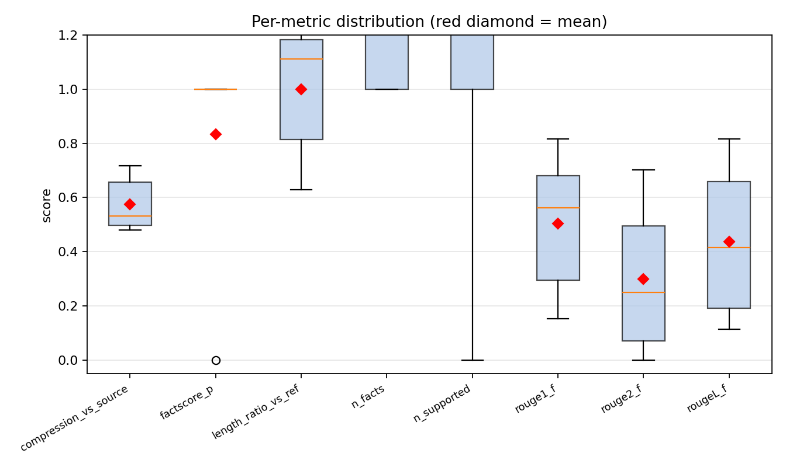
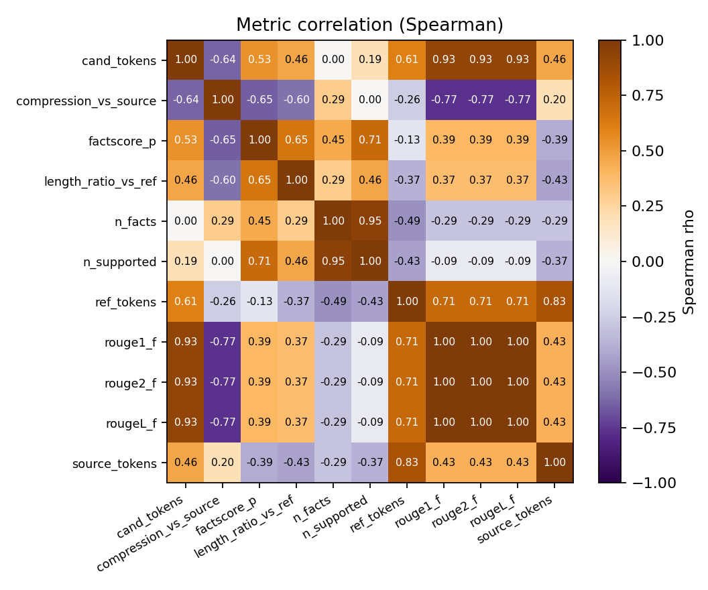
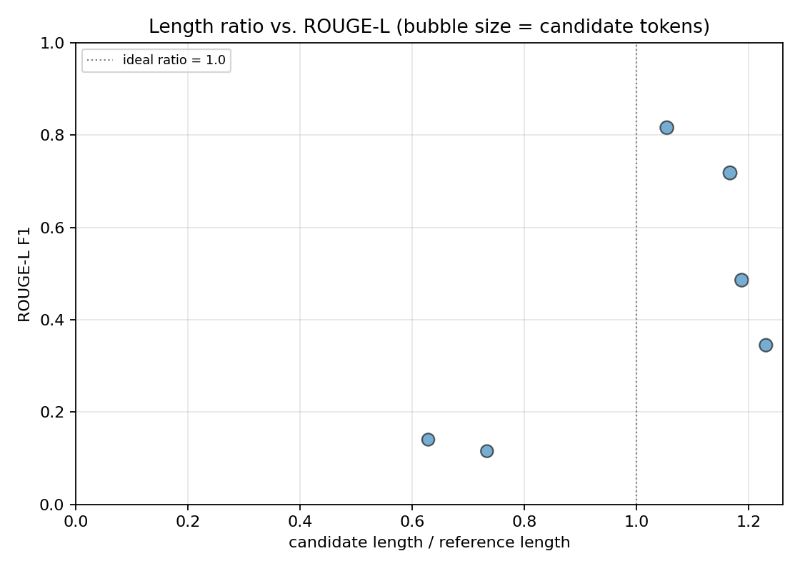
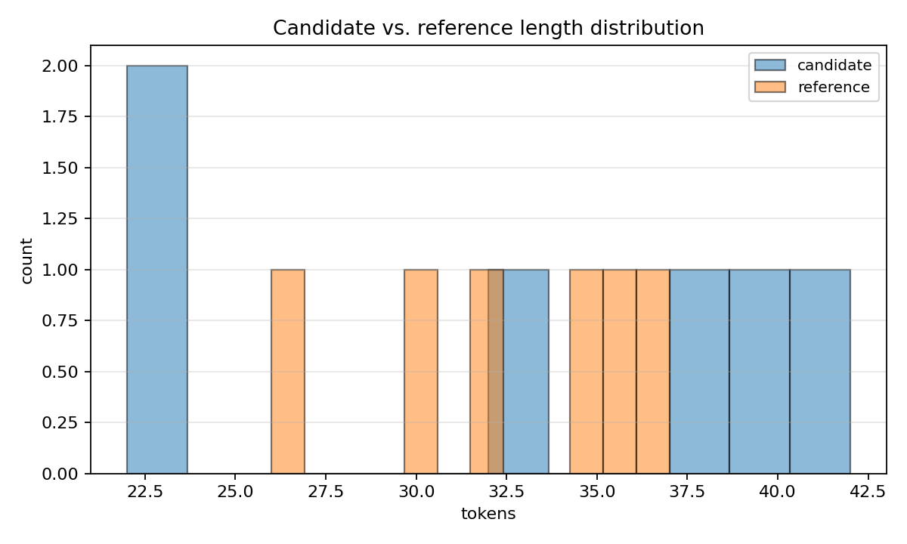
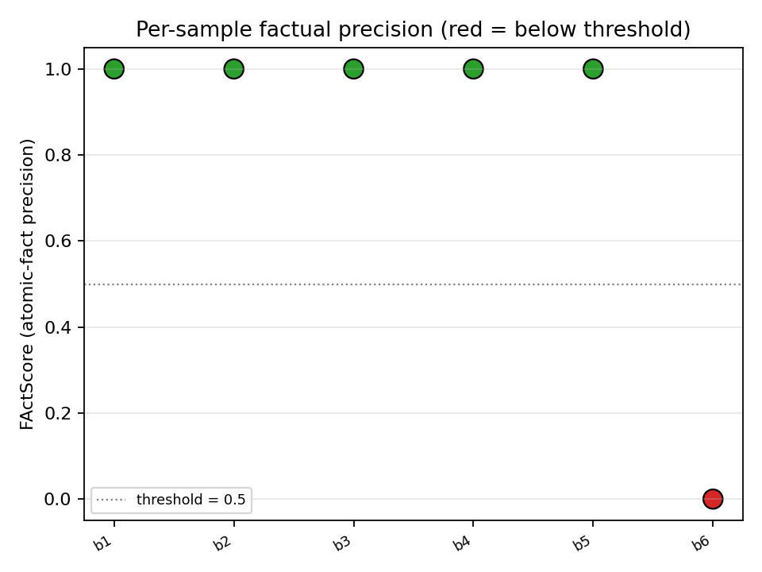
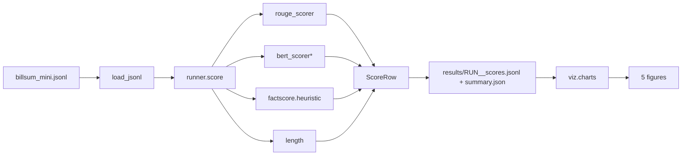

# lse — legal summarization evaluator

Multi-metric scorer for legal summarization, built around the failure modes that ROUGE
alone misses: ROUGE rewards verbatim copying, BERTScore catches paraphrase but ignores
factual correctness, FActScore-style atomic-fact precision catches hallucinations, and
the length/compression metrics catch the "summary is just the introduction copied
verbatim" pattern.

The eval target is BillSum-style legislation (long source -> short summary). The
fixture ships 6 hand-picked bills, including two intentionally bad candidates so the
charts have something to flag.

## What's in here

```
src/lse/
  types.py                       SummSample, ScoreRow
  metrics/
    rouge_scorer.py              ROUGE-1, ROUGE-2, ROUGE-L F1 (rouge-score wrapper)
    bert_scorer.py               BERTScore P/R/F1 (DistilBERT default; opt-in)
    factscore.py                 atomic-fact precision (sentence-level proxy)
    length.py                    token count, compression ratio, length ratio
  runner.py                      load -> score -> write JSONL + summary
  viz/charts.py                  five distinct chart types (box, correlation,
                                 length-vs-quality scatter, length overlay, factscore strip)
  cli/main.py                    typer: score, plots
```

## Why this metric set

| metric                 | what it catches                                     | cost          |
|------------------------|-----------------------------------------------------|---------------|
| ROUGE-1 / 2 / L F1     | lexical overlap with reference                      | free          |
| BERTScore F1           | paraphrased overlap                                 | model load    |
| FActScore (heuristic)  | sentence-level factual precision against source     | free          |
| compression_vs_source  | "summary" being mostly verbatim                     | free          |
| length_ratio_vs_ref    | over- and under-summarization                       | free          |

ROUGE alone is the standard giveaway. A model that copy-pastes the first paragraph of
the bill gets a high ROUGE-1 against any short reference that shares that paragraph
even if the candidate is technically a non-summary. The length-ratio and FActScore
columns together catch that pattern.

## Quickstart

```bash
make install
make eval           # scores the 6-sample fixture (CPU, ~5s without BERTScore)
make plots          # writes 5 figures into results/figures
# optional: include BERTScore (downloads DistilBERT)
uv run lse score --with-bertscore
```

## Visualizations

Five charts, different vocabulary than earlier projects:

#### 1. Per-metric box plot


One box per metric, mean shown as a red diamond. Compact way to see "which
metrics are bunched up at 1.0 (uninformative) and which spread out
(discriminative)".

#### 2. Metric correlation heatmap (Spearman)


Spearman because the length metrics are not linearly comparable to the
F-scores. Highly correlated metrics (|rho| > 0.8) are redundant; this is
where you see ROUGE-1 and ROUGE-L collapsing into one number on legal
text, where the long sentences kill ROUGE-L's LCS advantage.

#### 3. Length-vs-quality scatter


Each candidate placed on (length-ratio-vs-reference, ROUGE-L). Bubble
size = candidate tokens. The dotted line at ratio = 1.0 is the ideal;
points clustered above 1.0 are over-summarizers (copying), below 1.0 are
under-summarizers (missing content).

#### 4. Candidate vs reference length overlay


Histograms of candidate and reference token counts on the same axis.
A candidate distribution that does not overlap the reference distribution
is doing the wrong thing.

#### 5. Per-sample FActScore strip plot


One point per sample, colored by whether it crosses the 0.5 factual-
precision threshold. The chart that points you at specific bad samples
to look at.

## Results

> Pending the first scoring run on the in-repo BillSum mini fixture (6 bills, 4 clean
> candidates + 2 intentionally bad ones). The harness is verified by 9 unit tests
> covering token counts, length ratios, the sentence split, and the heuristic
> FActScore against a couple of trivial source-summary pairs. The first real
> `make eval` + `make plots` run will fill in the table and figures.

| metric                 |  mean  |  min  |  max  |
|------------------------|-------:|------:|------:|
| rouge1_f               |   TBD  |  TBD  |  TBD  |
| rouge2_f               |   TBD  |  TBD  |  TBD  |
| rougeL_f               |   TBD  |  TBD  |  TBD  |
| factscore_p            |   TBD  |  TBD  |  TBD  |
| compression_vs_source  |   TBD  |  TBD  |  TBD  |
| length_ratio_vs_ref    |   TBD  |  TBD  |  TBD  |

## Architecture



`*` BERTScore is opt-in via `--with-bertscore`; it downloads a small DistilBERT.

## Known limitations

- FActScore here is sentence-level token overlap, not the LLM-decomposed atomic-fact
  variant. It under-reports hallucinations that are paraphrased.
- ROUGE-L is the sentence-level rouge variant by default; for paragraph-length
  summaries the summary-level variant is more standard. Trivial to switch in the
  rouge-score config.
- BERTScore default backbone is DistilBERT for laptop friendliness; the published
  paper uses `microsoft/deberta-xlarge-mnli`. Switch via `model_type=...`.
- No bias-rescaled BERTScore (`rescale_with_baseline=True`); the absolute numbers are
  therefore higher than the rescaled-paper version, but rankings are unchanged.

## What's next

- [ ] LLM-decomposed atomic-fact FActScore (one sentence -> N facts via Claude/GPT).
- [ ] Multi-model run: ask several summarizers for the candidate, compare.
- [ ] Coverage metric: of the bill's named sections, how many appear in the summary?
- [ ] Citation precision when candidates include section pointers.

## References

- Kornilova, A., & Eidelman, V. (2019). *BillSum: A Corpus for Automatic Summarization
  of US Legislation.* EMNLP Workshop on New Frontiers in Summarization.
- Lin, C.-Y. (2004). *ROUGE: A Package for Automatic Evaluation of Summaries.* ACL.
- Zhang, T., et al. (2020). *BERTScore: Evaluating Text Generation with BERT.* ICLR.
- Min, S., et al. (2023). *FActScore: Fine-grained Atomic Evaluation of Factual
  Precision in Long Form Text Generation.* EMNLP.

## License

MIT.
